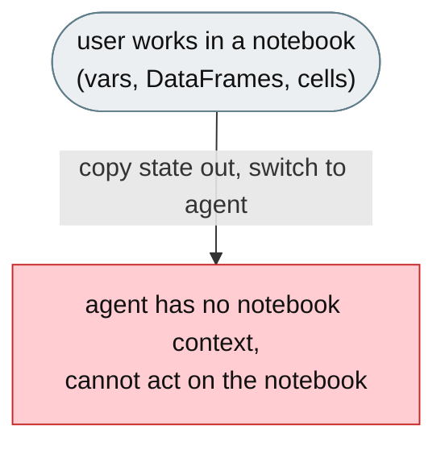
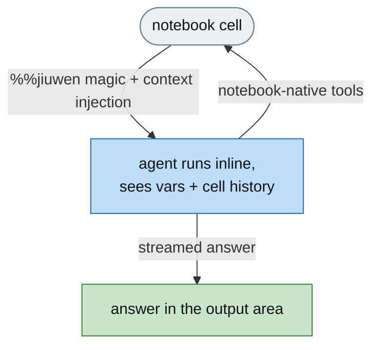
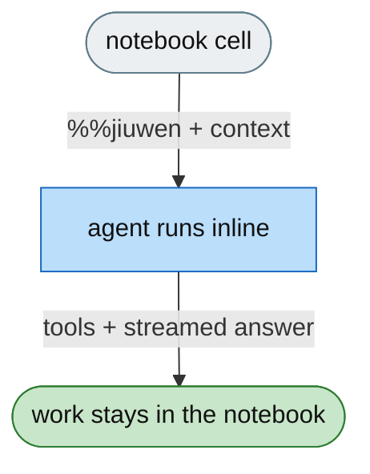

**[Feature]: Integrate JiuwenSwarm into Jupyter Notebooks and JupyterLab / 将 JiuwenSwarm 集成到 Jupyter 笔记本与 JupyterLab**

EN ======
JiuwenSwarm's agent lives outside the notebook, forcing users to copy state out and lose context. This feature adds Jupyter integration — `%%jiuwen` cell/line magics, notebook-native tools (read variables and cells, insert code), and a JupyterLab sidebar — so single agents and multi-agent swarms run directly inside the notebook workflow.

ZH ======
JiuwenSwarm 的智能体位于笔记本之外，迫使用户复制状态并丢失上下文。本特性新增 Jupyter 集成——`%%jiuwen` 单元格/行魔法命令、笔记本原生工具（读取变量与单元格、插入代码）以及 JupyterLab 侧边栏——使单智能体与多智能体 swarm 直接在笔记本工作流内运行。

---

# [Feature]: Jupyter integration — run single agents and multi-agent swarms directly inside the notebook

## Executive Summary

JiuwenSwarm's agent lives in a browser tab or CLI, but its users work in Jupyter notebooks. To use the agent on their code, data, or results, they must leave the notebook and lose the context of their variables, DataFrames, and cell history. This feature integrates JiuwenSwarm into the notebook: cell/line magics (`%%jiuwen`, `%jiuwen`), notebook-native tools (read/inspect variables, read and insert cells), and a JupyterLab sidebar panel — so agents run inline, no server, no context switching.

## Background Description

Jupyter users do their thinking in the notebook, where their work lives as variables, DataFrames, imported packages, and executed cells. The agent is elsewhere — a browser tab or CLI — so using it on the actual work requires copying state out of the notebook, losing surrounding context, and switching windows. The agent has no direct access to the user's variables, the cells they just ran, or the ability to insert code back into the notebook. Every round-trip breaks the flow.

## Design Ideas

### Proposed design

A Jupyter extension (works in PyCharm, VS Code, Google Colab, JupyterLab) with three surfaces:

- **Cell/line magics** — `%%jiuwen` (streamed answer), `%jiuwen` (one-liner), plus specialized magics: `%%jiuwen_explain`, `%%jiuwen_test`, `%jiuwen_audit`, `%jiuwen_story`, `%%jiuwen_profile`, `%%jiuwen_guard`, `%jiuwen_memory`, `%jiuwen_diff`, `%%jiuwen_safe`, `%jiuwen_todo`, `%jiuwen_export`, `%jiuwen_replay`, `%jiuwen_pin`/`%jiuwen_unpin`, `%jiuwen_chat`. Multi-agent team mode via `%%jiuwen --mode team`.
- **Notebook-native agent tools** — `read_variable(name)` inspects any Python variable; `read_notebook_cell(index)` lets the agent read any previous cell; `insert_notebook_cell(source)` / `replace_notebook_cell(index, source)` let the agent write code back into the notebook.
- **JupyterLab sidebar panel (JupyterLab 4+)** — a persistent chat panel, session list with per-notebook grouping, a live swarm-map of agent activity, and a status-bar indicator, with multi-kernel support over a Python comm bridge (all in-process, no external server).

Context injection lets the agent see the user's variables, DataFrames, imported packages, and recent cell history automatically.

## Involved Public APIs

New additions (the `jiuwenswarm-jupyter` package):

| API | Kind |
|---|---|
| `%%jiuwen` / `%jiuwen` and specialized magics | new IPython magics |
| `JupyterSwarm` | new class (programmatic async access to all agent modes) |
| `read_variable(name)` | new function (inspect any Python variable) |
| `read_notebook_cell(index)` | new function (read a previous cell) |
| `insert_notebook_cell(source)` | new function (insert a runnable cell) |
| `replace_notebook_cell(index, source)` | new function (rewrite a cell with a diff dialog) |
| JupyterLab sidebar panel | new frontend (chat, session list, swarm map, status bar) |

**Impact:** additive — `pip install jiuwenswarm-jupyter[lab]`; the cell magics work in any Jupyter environment, and the sidebar requires JupyterLab 4+. No change to the JiuwenSwarm agent runtime.

## Description of Relevance to Other Modules

- **`jiuwenswarm_jupyter`** — the IPython extension defining magics and notebook-native tools.
- **JupyterLab sidebar** — a frontend over the shared agent protocol, reusing webview HTML from the IDE plugin.
- **`~/.jiuwenswarm/config/config.yaml`** — reused configuration; no separate setup.
- **JiuwenSwarm server** — intentionally unchanged; the comm bridge keeps all messages in-process.

## Test Design and Test Plan

Unit/integration tests:

1. **Magics** — each magic executes and streams output in the notebook; `%%jiuwen --mode team` spawns parallel agents.
2. **Notebook-native tools** — `read_variable`, `read_notebook_cell`, `insert_notebook_cell`, and `replace_notebook_cell` behave correctly across environments.
3. **Context injection** — the agent sees the current variables, DataFrames, packages, and recent cell history.
4. **Named sessions** — conversation carries across multiple cells.
5. **Sidebar panel** — chat, session list, swarm map, and status bar work across notebook tabs; multi-kernel switching does not reconnect the comm bridge.
6. **Explain / test / audit** — `%%jiuwen_explain`, `%%jiuwen_test`, `%jiuwen_audit` produce the expected markdown/pytest output.

Performance/reliability:

- **In-process** — all messages stay in-process over the comm bridge; no external server dependency for the cell-magic path.

## Additional Information

## Solution

**What type of PR is this?**
/kind feature

---

## **What does this PR do / why do we need it**

This PR adds Jupyter integration — cell/line magics, notebook-native agent tools, and a JupyterLab sidebar — so agents and swarms run directly inside the notebook workflow.

---

## **Problem**

Jupyter users work in the notebook, but the agent lives elsewhere, forcing them to copy state out, lose context, and switch windows. The agent has no access to notebook variables, cells, or the ability to write code back.

---

## **Solution**

Add `%%jiuwen`/`%jiuwen` magics, notebook-native tools (`read_variable`, `read_notebook_cell`, `insert_notebook_cell`, `replace_notebook_cell`), automatic notebook-context injection, and a JupyterLab sidebar panel with a swarm map and multi-kernel support.

---

## **Expected Impact**

- Agents run inline in the notebook — no context switching.
- The agent reads variables/cells and can write code back into the notebook.
- Swarms and sidebar panels bring multi-agent activity into the notebook.
- Works across PyCharm, VS Code, Google Colab, and JupyterLab.

---

## **Self-checklist**

- [x] **Design**: Magic + tools + sidebar architecture reviewed against the RAT
- [x] **Test**: Magics, notebook-native tools, context injection, and sidebar covered
- [x] **Verification**: Confirmed multi-environment support and in-process comm bridge
- [ ] **Interface**: No change to the JiuwenSwarm agent runtime
- [x] **Document**: Full documentation added
